# TrustNova AI — Banking Copilot Platform

> **AI-powered banking intelligence platform** combining a 13-role RBAC API, RAG-based copilot, multi-model fraud detection, real-time compliance monitoring, and a React 18 + TypeScript frontend — all containerised and CI/CD-ready.

---

## Table of Contents

- [Overview](#overview)
- [Business Problem](#business-problem)
- [Solution](#solution)
- [Key Features](#key-features)
- [Architecture](#architecture)
- [Technology Stack](#technology-stack)
- [Frontend Architecture](#frontend-architecture)
- [Backend Architecture](#backend-architecture)
- [Database Design](#database-design)
- [AI Components](#ai-components)
- [Security](#security)
- [Installation](#installation)
- [Configuration](#configuration)
- [API Endpoints](#api-endpoints)
- [User Roles & Permissions](#user-roles--permissions)
- [Banking Use Cases](#banking-use-cases)
- [User Workflow](#user-workflow)
- [Project Structure](#project-structure)
- [CI/CD Pipeline](#cicd-pipeline)
- [Future Enhancements](#future-enhancements)
- [License](#license)

---

## Overview

**TrustNova AI** is a full-stack, production-grade banking copilot that puts AI-driven intelligence at the fingertips of every banking professional. It unifies customer data, compliance workflows, fraud detection, and a conversational AI assistant into a single role-aware platform — serving 13 distinct banking personas from a Personal Banker to a Bank Executive.

The platform is built on four technical pillars:

| Pillar | Implementation |
|--------|---------------|
| **Intelligent Chat** | RAG pipeline (ChromaDB + Sentence Transformers + Groq/OpenAI) with 5-metric AI Trust Scoring |
| **Banking Operations** | 20+ REST APIs across customers, accounts, transactions, loans, credit cards, treasury, appointments |
| **Risk & Compliance** | Fraud detection (XGBoost + SHAP), AML case management, KYC workflow, risk assessment engine |
| **Observability** | Prometheus metrics, Grafana dashboards, full audit trail, LLM cost tracking |

---

## Business Problem

Modern banks face three critical operational gaps:

1. **Information Fragmentation** — Relationship managers juggle 5–10 separate systems to assemble a customer picture before a meeting, wasting 30–60 minutes per client.
2. **Compliance Latency** — AML analysts, KYC reviewers, and fraud investigators work from disconnected queues with no unified risk signal, leading to delayed SARs and missed alerts.
3. **AI Opacity** — LLM-powered tools in banking lack explainability mechanisms; compliance teams cannot audit *why* an AI produced a specific recommendation.

---

## Solution

TrustNova AI addresses these gaps with three converging capabilities:

- **Customer 360° Copilot** — One query assembles a complete pre-meeting brief: profile, transactions, trust score, sentiment trend, risk flags, product recommendations.
- **Unified Compliance Desk** — A single interface surfaces AML cases, KYC status, fraud alerts, and risk bands with role-appropriate actions.
- **Trustworthy AI** — Every AI response carries a 5-component Trust Score (0–100) covering retrieval confidence, hallucination probability, model agreement, citation quality, and prompt reliability — with full audit persistence.

---

## Key Features

### Core Banking Operations
- **Customer Management** — Search, list, create customers; 360° customer summary view
- **Account Intelligence** — Account listing with balance aggregation and type breakdown
- **Transaction Analytics** — Period-filtered transaction views (daily → annual) with flagging support
- **Loan Portfolio** — Loan lifecycle tracking by type, status, officer assignment, and portfolio value
- **Credit Card Applications** — End-to-end application flow: submission → review → approval with auto-generated application numbers
- **Appointment Booking** — Role-scoped calendar with type, duration, location, and assignment management
- **Treasury Dashboard** — Position tracking (bonds, equities), liquidity metrics, portfolio yield summary

### AI & Intelligence
- **RAG Banking Copilot** — Conversational AI grounded in bank policy documents with multi-turn memory (last 5 turns)
- **AI Trust Score** — 5-component trustworthiness score on every AI response, persisted for audit
- **Customer Trust Score** — 5-factor customer reliability score (account age, credit, fraud history, sentiment, interaction count)
- **Fraud Detection** — XGBoost scoring with SHAP feature attribution, optional Isolation Forest ensemble, and optional LLM narrative
- **Sentiment Analysis** — Batch sentiment processing across interactions, support tickets, complaints, and chat transcripts
- **Risk Profiling** — Composite customer risk band (credit, fraud, AML, operational risk dimensions)
- **Retention Prediction** — Logistic regression model estimating churn probability from 5 customer signals
- **LLM Router** — Multi-provider (Groq + OpenAI) task-based routing with exponential backoff and cost tracking

### Compliance & Risk
- **AML Case Management** — Open/close cases, SAR filing flag, case assignment, risk-level filtering
- **KYC Workflow** — Document verification lifecycle with auto-populated verification metadata
- **Risk Assessment** — Portfolio-level and per-customer risk scoring across 4 risk dimensions
- **Access Request Management** — Role/resource access requests with admin review workflow

### Platform Operations
- **KPI Dashboard** — Real-time bank metrics: customer count, active accounts, transaction volume, loan portfolio, open AML cases, pending KYC
- **Notification System** — Per-user notification delivery with broadcast and admin-targeted channels
- **Announcements** — Role-targeted, priority-aware announcements with expiry dates
- **User Administration** — User activation, deactivation, and role reassignment
- **Bug Reporting** — In-app feedback with severity triage and admin resolution tracking
- **Document Management** — PDF/TXT/CSV/JSON upload pipeline to vector store (ChromaDB or Pinecone)

### Security & Auditability
- **JWT Authentication** — HS256 tokens with configurable expiry (default 8 hours)
- **13-Role RBAC** — Granular permissions per resource:action pair with wildcard support
- **Audit Logging** — Every sensitive operation logged with username, action, resource, IP, and timestamp
- **Security Headers** — X-Content-Type-Options, X-Frame-Options, X-XSS-Protection on all responses
- **Full Observability** — Prometheus metrics, Grafana dashboards, LLM usage + cost logging

---

## Architecture

### System Architecture

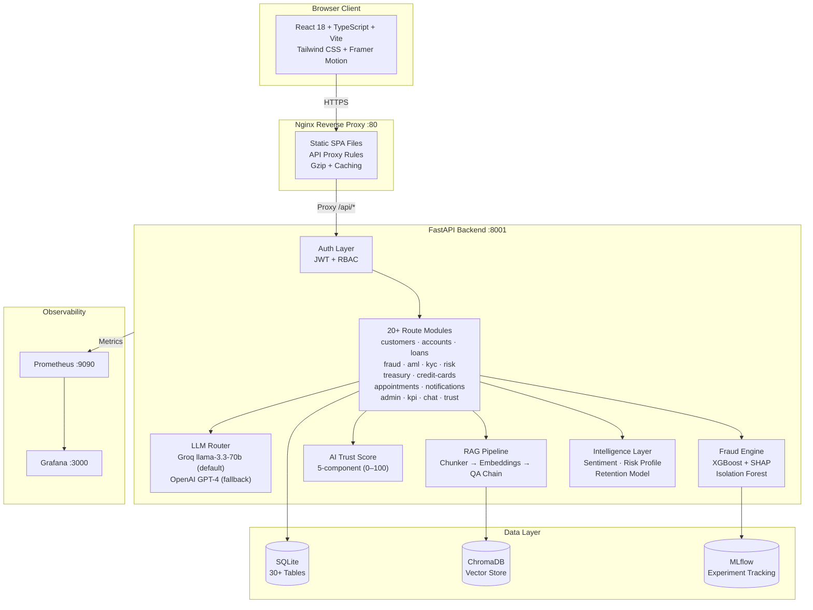

### Application Data Flow

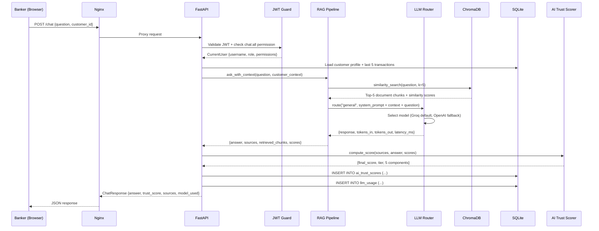

### Banking Workflow

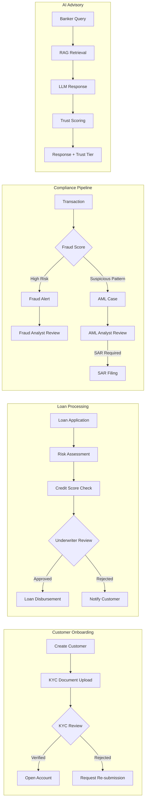

---

## Technology Stack

### Backend

| Category | Technology | Version |
|----------|-----------|---------|
| **Runtime** | Python | 3.11 |
| **Framework** | FastAPI | ≥ 0.111.0 |
| **ASGI Server** | Uvicorn | ≥ 0.30.0 |
| **Validation** | Pydantic | ≥ 2.7.0 |
| **Database ORM** | SQLAlchemy | ≥ 2.0.0 |
| **Database** | SQLite | development |
| **LLM Orchestration** | LangChain | ≥ 0.2.0 |
| **LLM — Groq** | LangChain-Groq | ≥ 0.1.0 |
| **LLM — OpenAI** | LangChain-OpenAI | ≥ 0.1.0 |
| **Embeddings** | Sentence Transformers | ≥ 3.0.0 |
| **Vector Store (local)** | ChromaDB | ≥ 0.5.0 |
| **Vector Store (cloud)** | Pinecone | ≥ 3.0.0 |
| **Fraud Model** | XGBoost | ≥ 2.0.0 |
| **ML Utilities** | scikit-learn | ≥ 1.4.0 |
| **Class Imbalance** | imbalanced-learn | ≥ 0.11.0 |
| **Explainability** | SHAP | ≥ 0.44.0 |
| **Deep Learning** | PyTorch | ≥ 2.1.0 |
| **Experiment Tracking** | MLflow | ≥ 2.12.0 |
| **Auth — Tokens** | python-jose | ≥ 3.3.0 |
| **Auth — Passwords** | bcrypt | ≥ 4.0.0 |
| **Rate Limiting** | SlowAPI | ≥ 0.1.9 |
| **Metrics** | prometheus-fastapi-instrumentator | ≥ 7.0.0 |
| **Data Processing** | Pandas | ≥ 2.1.0 |
| **Test Data** | Faker | ≥ 19.0.0 |
| **Testing** | pytest | ≥ 8.0.0 |

### Frontend

| Category | Technology | Version |
|----------|-----------|---------|
| **Framework** | React | 18.3.1 |
| **Language** | TypeScript | 5.5.3 |
| **Build Tool** | Vite | 5.4.1 |
| **Styling** | Tailwind CSS | 3.4.10 |
| **Animation** | Framer Motion | 11.3.19 |
| **Utility** | clsx | 2.1.1 |
| **PostCSS** | PostCSS + Autoprefixer | 8.4.41 / 10.4.20 |
| **Linting** | ESLint | 9.9.0 |

### Infrastructure

| Component | Technology | Version |
|-----------|-----------|---------|
| **Web Server** | Nginx | 1.25-alpine |
| **Containerisation** | Docker + Docker Compose | latest |
| **Metrics** | Prometheus | 2.51.0 |
| **Dashboards** | Grafana | 10.4.0 |
| **CI/CD** | GitHub Actions | — |
| **Image Registry** | GitHub Container Registry (GHCR) | — |

---

## Frontend Architecture

```
frontend-react/
├── src/
│   ├── main.tsx               # React entry point (StrictMode)
│   ├── App.tsx                # Root component — auth state, route switching
│   ├── index.css              # Tailwind base + global glass morphism utilities
│   ├── lib/
│   │   ├── api.ts             # Typed API client (all endpoints, fetch-based)
│   │   └── auth.ts            # Auth singleton: setSession, getToken, getUser,
│   │                          #   clear, isAuthenticated, hasNavSection, hasPermission
│   ├── pages/
│   │   ├── LoginPage.tsx      # Login form with 13 role quick-fill demo buttons
│   │   ├── BankerCopilot.tsx  # Main shell: Sidebar + TopBar + content router
│   │   └── FraudMonitor.tsx   # Fraud dashboard: alert list + summary stats
│   └── components/            # Feature component library (role-gated)
│       ├── Customer360/       # Full customer profile drill-through
│       ├── CustomerSearch/    # Search bar with results list
│       ├── Accounts/          # Account list, stats, filters
│       ├── Transactions/      # Transaction table with period filter
│       ├── Loans/             # Loan portfolio view
│       ├── CreditCards/       # Credit card application manager
│       ├── Appointments/      # Calendar and appointment booking
│       ├── AML/               # AML case queue and case updater
│       ├── KYC/               # KYC record list and verification form
│       ├── Risk/              # Risk assessment dashboard
│       ├── Treasury/          # Treasury positions and liquidity metrics
│       ├── Chat/              # AI Copilot chat interface
│       ├── Notifications/     # Notification bell + panel
│       ├── Announcements/     # Announcement board
│       ├── Admin/             # User management panel
│       └── BugReport/         # In-app bug submission
├── vite.config.ts             # Vite config with @/ alias -> ./src/
├── tsconfig.app.json          # Strict TS, bundler module resolution
├── tailwind.config.js         # Tailwind with banking colour palette
├── package.json               # Dependencies (React 18, Framer Motion, clsx)
└── package-lock.json          # Pinned dependency tree for CI reproducibility
```

**Key Patterns:**

- **Auth singleton** (`src/lib/auth.ts`) — `hasNavSection(section)` gates sidebar navigation; `hasPermission(permission)` gates component actions
- **Typed API client** (`src/lib/api.ts`) — One function per API resource, all returning typed promises. No raw fetch calls in components.
- **Role-aware sidebar** — Navigation items rendered only when the logged-in user's `nav_sections` list includes that section
- **Glass morphism UI** — CSS utility classes `.glass`, `.glass-card`, `.gradient-text` with Tailwind backdrop-blur
- **Framer Motion** — Page transitions and list animations throughout

---

## Backend Architecture

```
src/
├── api/
│   ├── main.py               # FastAPI app: CORS, middleware, 20+ routers, /health
│   ├── auth.py               # JWT issuance, RBAC, 13 roles, demo user seeding,
│   │                         # audit log, require_permission(), require_role()
│   ├── llm_router.py         # Multi-provider LLM router (Groq + OpenAI),
│   │                         # task-based routing, retry with backoff, cost logging
│   └── routes/
│       ├── chat.py            # POST /chat — RAG copilot + AI Trust Scoring
│       ├── trust.py           # GET /trust/score, /trust/history, /trust/ai-history
│       ├── documents.py       # GET /documents/index, POST /documents/upload
│       ├── customers.py       # CRUD + search + 360 degree summary
│       ├── accounts.py        # List + stats
│       ├── transactions.py    # List + stats (period-filtered)
│       ├── loans.py           # List + portfolio stats + customer loans
│       ├── fraud.py           # POST /fraud/check (XGBoost+SHAP), GET /fraud/alerts
│       ├── aml.py             # Case management + SAR tracking
│       ├── kyc.py             # KYC lifecycle + verification workflow
│       ├── risk.py            # Customer + portfolio + segment risk
│       ├── treasury.py        # Positions + liquidity + summary
│       ├── credit_cards.py    # Application submit -> review -> approve
│       ├── appointments.py    # Booking + cancellation (role-scoped)
│       ├── kpi.py             # Real-time bank KPI aggregation
│       ├── notifications.py   # Per-user + broadcast notifications
│       ├── announcements.py   # Role-targeted announcements
│       ├── bug_reports.py     # Feedback triage
│       ├── admin_users.py     # User activation + role management
│       └── access_requests.py # Access request + review workflow
├── models/
│   ├── ai_trust.py           # 5-component AI trust scorer
│   ├── database.py           # SQLAlchemy engine factory + table init
│   └── schemas.py            # Pydantic request/response models
├── rag/
│   ├── document_loader.py    # Load TXT/PDF/CSV/JSON -> index pipeline
│   ├── chunker.py            # RecursiveCharacterTextSplitter + section detection
│   ├── embeddings.py         # Sentence Transformers / OpenAI embedding backends
│   ├── vector_store.py       # ChromaDB / Pinecone abstraction layer
│   ├── qa_chain.py           # ConversationalRetrievalChain + single-shot QA
│   └── customer_context.py   # Assemble 360 degree customer brief for RAG injection
├── intelligence/
│   ├── sentiment.py          # Batch sentiment scoring + trend detection + alerts
│   └── risk_profile.py       # Composite risk profile + retention probability model
└── data/
    ├── generate_customers.py  # 1,000 synthetic customer profiles
    ├── generate_transactions.py
    ├── generate_interactions.py
    ├── generate_support_tickets.py
    ├── generate_fraud_alerts.py
    ├── generate_chat_transcripts.py
    ├── generate_complaints.py
    └── etl_pipeline.py        # Orchestrate all generators -> banking.db
```

**Request Processing Pipeline:**

```
HTTP Request
    -> Nginx (TLS termination, gzip, static files)
    -> FastAPI middleware (CORS, security headers, rate limiting, Prometheus)
    -> JWT validation (python-jose, HS256)
    -> RBAC permission check (require_permission / require_role)
    -> Route handler
    -> SQLAlchemy (SQLite queries)
    -> AI/ML layer (LLM router / fraud engine / RAG / trust scorer)
    -> Audit log write
    -> JSON response
```

---

## Database Design

The application uses **SQLite** in development (30+ tables, auto-created on startup). The schema is managed directly via SQLAlchemy `text()` DDL inside route modules — each module creates and owns its tables.

### Entity Relationship Overview

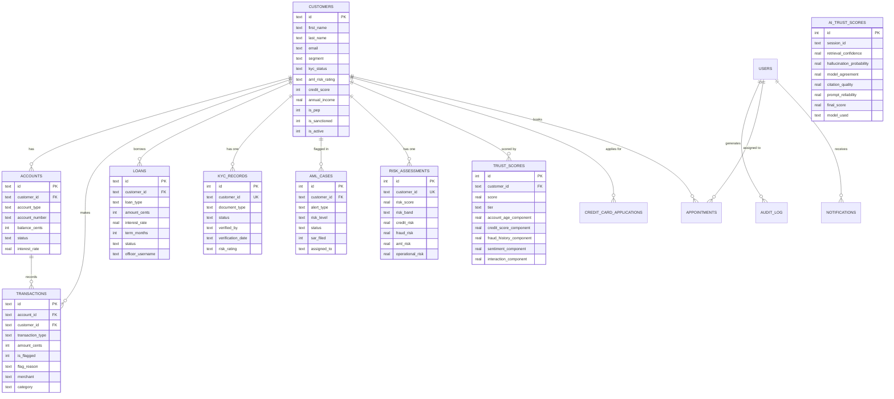

### Complete Table Inventory

| Table | Purpose | Key Fields |
|-------|---------|-----------|
| `users` | Platform user accounts | username, hashed_password, role, is_active |
| `audit_log` | Security audit trail | username, action, resource, ip_address |
| `customers` | Customer master data | id, segment, kyc_status, aml_risk_rating, credit_score, is_pep |
| `accounts` | Bank accounts | customer_id, account_type, balance_cents, status |
| `transactions` | Transaction ledger | account_id, amount_cents, is_flagged, merchant, category |
| `loans` | Loan portfolio | customer_id, loan_type, amount_cents, status, officer_username |
| `aml_cases` | AML case queue | customer_id, risk_level, status, sar_filed, assigned_to |
| `kyc_records` | KYC document status | customer_id (UNIQUE), status, verified_by, document_type |
| `risk_assessments` | Customer risk scores | customer_id (UNIQUE), risk_score, risk_band, 4 risk dimensions |
| `trust_scores` | Customer trust scores | customer_id, score, tier, 5 weighted components |
| `ai_trust_scores` | AI response quality | session_id, final_score, 5 trust components, model_used |
| `treasury_positions` | Investment portfolio | instrument, cusip, position_type, market_value, yield_rate |
| `liquidity_metrics` | Liquidity KPIs | metric_name (UNIQUE), value, threshold, status |
| `credit_card_applications` | Card applications | application_number (UNIQUE), customer_id, status, approved_limit_cents |
| `appointments` | Customer meetings | customer_id, assigned_to, appointment_type, scheduled_at |
| `notifications` | User notifications | user_id, title, category, is_read |
| `announcements` | System announcements | title, priority, target_roles, is_active, expires_at |
| `bug_reports` | Platform feedback | severity, status, submitted_by, assigned_to |
| `access_requests` | Permission requests | requested_by, role, resource, status, reviewed_by |
| `llm_usage` | LLM cost tracking | model, provider, tokens_in, tokens_out, cost_usd, latency_ms |
| `fraud_alerts` | Fraud detection results | customer_id, fraud_probability, risk_tier, explanation |
| `sentiment_scores` | Customer sentiment | customer_id, source_type, sentiment_label, sentiment_score |
| `alerts` | Risk/sentiment alerts | customer_id, alert_type, severity, status |

---

## AI Components

### 1. LLM Router

The `src/api/llm_router.py` module provides a unified interface to multiple LLM providers with automatic fallback and full cost telemetry.

```
Task Type          Provider=Groq                   Provider=OpenAI
───────────────────────────────────────────────────────────────────
summarization   -> llama-3.3-70b-versatile         gpt-4
fraud_reasoning -> llama-3.3-70b-versatile         gpt-4
compliance      -> llama-3.3-70b-versatile         gpt-4
sensitive       -> llama-3.3-70b-versatile         gpt-3.5-turbo
lookup          -> llama-3.3-70b-versatile         gpt-3.5-turbo
sentiment       -> llama-3.3-70b-versatile         gpt-3.5-turbo
general         -> llama-3.3-70b-versatile         gpt-4
```

**Retry Strategy:** 3 attempts with 2s → 4s → 8s exponential backoff
**Fallback Chain:** Primary model → Groq → OpenAI GPT-4 → OpenAI GPT-3.5
**Telemetry:** Every call logged to `llm_usage` with model, provider, tokens, cost (USD), latency (ms), success flag

**Token Costs (per 1K tokens):**

| Model | Input | Output |
|-------|-------|--------|
| llama-3.3-70b-versatile | $0.00005 | $0.00008 |
| gpt-4 | $0.030 | $0.060 |
| gpt-3.5-turbo | $0.0005 | $0.0015 |

---

### 2. AI Trust Score

Every response from the `/chat` endpoint carries a **5-component trust score (0–100)** computed by `src/models/ai_trust.py`:

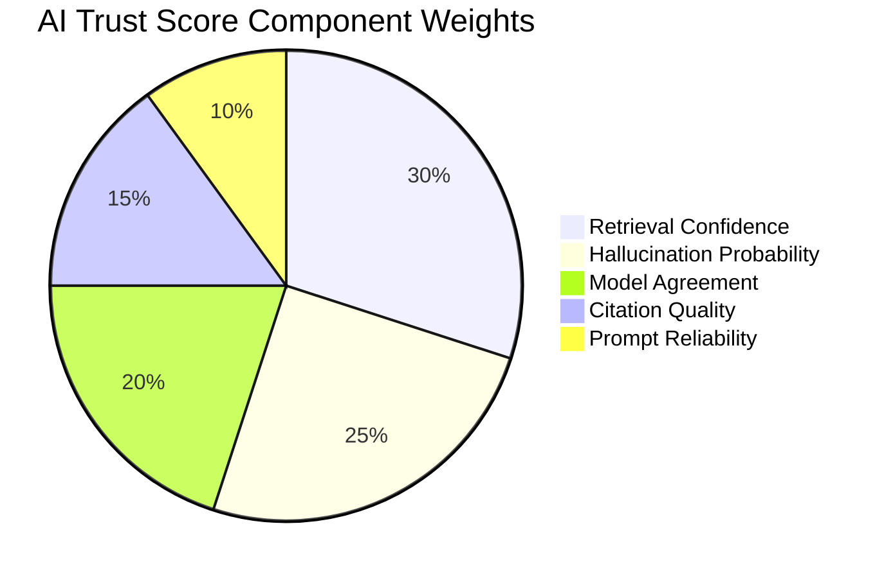

| Component | Weight | How Computed |
|-----------|--------|--------------|
| **Retrieval Confidence** | 30% | Average cosine similarity of top-5 ChromaDB chunks against the query |
| **Hallucination Probability** | 25% | `(1 - hallucination_probability)` — LLM fact-checked against source documents |
| **Model Agreement** | 20% | Jaccard similarity between primary and secondary model responses |
| **Citation Quality** | 15% | Regex matching for "Section X", "Page Y", "According to", regulation references |
| **Prompt Reliability** | 10% | Rolling average of the last 20 trust scores for the same system prompt |

**Trust Tiers:**

| Score | Tier |
|-------|------|
| 80–100 | High Confidence |
| 60–79 | Moderate Confidence |
| 40–59 | Low Confidence |
| 0–39 | Unreliable |

All scores persist to `ai_trust_scores` with full component breakdown for audit.

---

### 3. Customer Trust Score

The `/trust/score/{customer_id}` endpoint calculates a **5-factor customer reliability score**:

| Component | Weight | Normalisation |
|-----------|--------|--------------|
| Account Age | 20% | `days / 3,650` (10 years = 100) |
| Credit Score | 30% | `(score - 300) / 550 * 100` |
| Fraud History | 25% | `100 - (fraud_count * 25)`, minimum 0 |
| Sentiment Average | 15% | Maps -1.0 to +1.0 sentiment scale to 0–100 |
| Interaction Count | 10% | `count / 20 * 100`, capped at 20 interactions |

**Tiers:** Trusted (71–100) · Moderate (41–70) · High Risk (0–40)

---

### 4. Fraud Detection Engine

The fraud module (`src/models/fraud_detector.py`) implements a production-grade fraud scoring pipeline:

**Model:** XGBoost with 10 input features
**Features:** `amount`, `hour`, `geo_mismatch`, `device_new`, `amount_zscore`, `velocity_30m`, `credit_score`, `account_age_days`, `is_weekend`, `merchant_risk`

**Training Pipeline:**
1. Generate synthetic dataset with realistic fraud distribution
2. SMOTE oversampling — 10% fraud rate in training set
3. 80/20 stratified train/test split
4. StandardScaler normalisation
5. XGBoost with class-weight balancing (`scale_pos_weight`)
6. MLflow experiment tracking + model versioning

**Explainability (SHAP):** Top 3 risk factors returned per prediction with direction (increases/decreases risk) and SHAP value magnitude.

**Optional Ensemble:** Isolation Forest anomaly score can be blended with XGBoost output (`use_ensemble=true`)

**Optional LLM Narrative:** Full natural-language fraud explanation via GPT-4 (`use_llm_explanation=true`)

**Risk Tiers:**

| Probability | Tier |
|-------------|------|
| >= 0.70 | High Risk |
| 0.30–0.69 | Medium Risk |
| < 0.30 | Low Risk |

---

### 5. RAG Pipeline

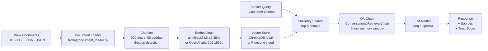

**Banking Documents Indexed** (from `data/raw/banking_docs/`):

`business_banking.txt` · `compliance_guide.txt` · `credit_cards.txt` · `digital_banking.txt` · `faq_general.txt` · `fee_schedule.txt` · `loan_policies.txt` · `mortgage_guide.txt` · `savings_products.txt` · `wealth_management.txt` · `wire_transfers.txt` · `bank_overview.txt` · `compliance_aml_kyc.txt` · `operations_procedures.txt` · `products_services_guide.txt` · `risk_fraud_security.txt`

**Customer Context Injection:** Before retrieval, the QA chain is prepended with the full customer brief: profile, last 5 transactions, trust score, sentiment trend, risk profile, fraud history, and product recommendations.

---

### 6. Sentiment & Intelligence Layer

**Sentiment Analysis** (`src/intelligence/sentiment.py`):
- Batch processes: `interactions`, `support_tickets`, `complaints`, `chat_transcripts`
- Scores: -1.0 (Negative) to 0.0 (Neutral) to +1.0 (Positive)
- Monthly trend tracking with improving/declining/stable classification
- Automatic alert generation when 2+ consecutive declining months detected

**Risk Profiling** (`src/intelligence/risk_profile.py`):
- Composite risk score from: credit score, balance level, account age, sentiment, fraud history
- Four risk dimensions: credit, fraud, AML, operational
- Output: `risk_level` (High/Medium/Low), `risk_factors` list, `retention_probability` (0–1)

**Retention Model:**
- Algorithm: Logistic Regression with StandardScaler
- Features: `avg_sentiment`, `support_ticket_count`, `fraud_flag_count`, `interaction_count`, `balance_normalized`
- Saved to `models/retention_model.pkl` after training
- Inference: `predict_retention(customer_id)` returns churn probability

---

## Security

### Authentication & Authorisation

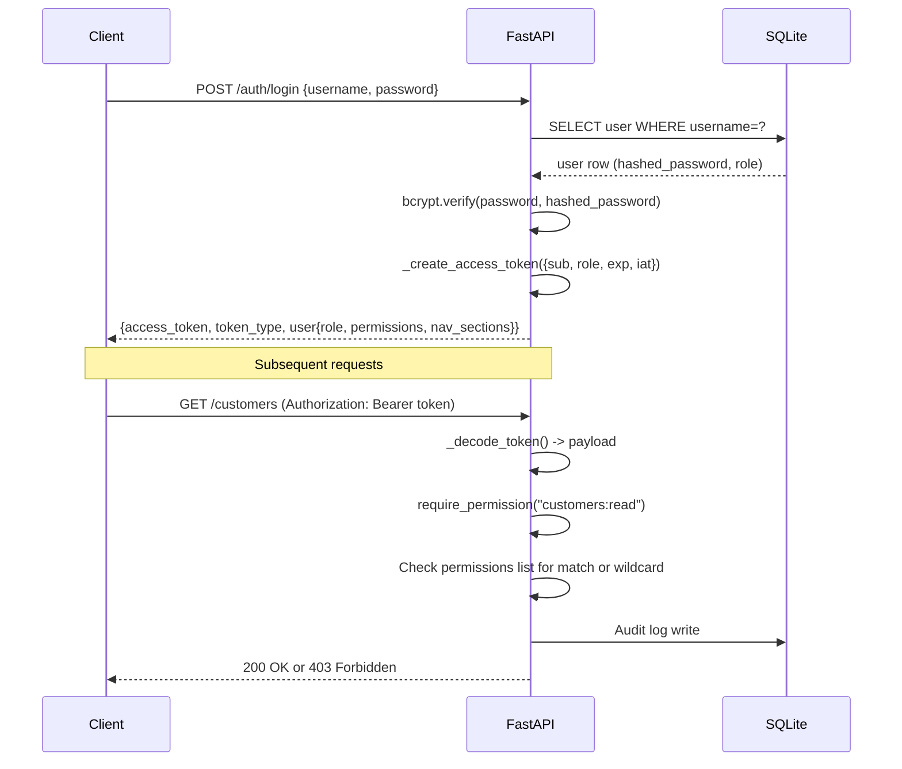

### JWT Specification

| Property | Value |
|----------|-------|
| Algorithm | HS256 (HMAC-SHA256) |
| Secret Key | `JWT_SECRET_KEY` env var |
| Token Expiry | `JWT_EXPIRE_MINUTES` env var (default: 480 min / 8 hrs) |
| Token Payload | `sub` (username), `role`, `exp`, `iat` |

### Permission Format

Permissions follow `resource:action` notation with wildcard support:

```
"*"                    -> admin (all resources, all actions)
"customers:read"       -> read customer records
"fraud:write"          -> write fraud case data
"fraud:investigate"    -> investigate flag (role: fraud_analyst)
"chat:all"             -> all chat actions (satisfies "chat:query")
"aml:sar"              -> SAR filing (role: aml_analyst)
"credit_cards:approve" -> review and approve applications
```

### Security Headers

Applied to every response via FastAPI middleware:

```
X-Content-Type-Options: nosniff
X-Frame-Options: DENY
X-XSS-Protection: 1; mode=block
```

### Audit Trail

Every sensitive operation writes to `audit_log`:

```json
{
  "username": "jane.doe",
  "action": "read",
  "resource": "customers",
  "resource_id": "CUST-12345678",
  "ip_address": "192.168.1.50",
  "timestamp": "2026-06-14T09:23:11.450Z"
}
```

---

## Installation

### Prerequisites

- Docker Desktop (recommended) **or** Python 3.11 + Node 20 installed locally
- Git
- A Groq API key (free at console.groq.com) for the AI Copilot

### Option A — Docker Compose (Recommended)

```bash
# 1. Clone the repository
git clone https://github.com/prakash-94/Trustnova-AI.git
cd Trustnova-AI

# 2. Create environment file
cp deployment/.env.example .env
# Edit .env — set at minimum: GROQ_API_KEY

# 3. Build and start all services
docker compose -f deployment/docker-compose.yml up --build
```

Services started:

| Service | URL |
|---------|-----|
| Frontend | http://localhost:80 |
| Backend API | http://localhost:8001 |
| API Docs | http://localhost:8001/docs |
| ChromaDB | http://localhost:8002 |
| Prometheus | http://localhost:9090 |
| Grafana | http://localhost:3000 |

### Option B — Local Development

**Backend:**

```bash
# Create virtual environment
python -m venv .venv
source .venv/bin/activate      # Windows: .venv\Scripts\activate

# Install dependencies
pip install -r requirements.txt

# Seed the database and index documents
python -m src.data.generate_customers
python -m src.data.generate_transactions
python -m src.data.generate_interactions
python -m src.data.generate_support_tickets
python -m src.data.generate_fraud_alerts
python -m src.data.generate_chat_transcripts
python -m src.data.generate_complaints
python -m src.data.etl_pipeline
python -m src.rag.document_loader

# Start the backend
uvicorn src.api.main:app --reload --port 8001
```

**Frontend:**

```bash
cd frontend-react
npm install
npm run dev        # -> http://localhost:3000 (proxies API calls to backend:8001)
```

**Run Tests:**

```bash
pytest tests/ -v
# Expected: 291 passed
```

---

## Configuration

### Free-tier Render + Vercel deployment

The included `render.yaml` uses `requirements-render.txt` and lexical policy
retrieval so the API does not install or load PyTorch, sentence-transformers,
or a local Chroma database on a stateless free instance. Set these variables:

- Render: `GROQ_API_KEY`, `JWT_SECRET_KEY`, `ADMIN_PASSWORD`, and
  `CORS_ORIGINS=https://<your-vercel-project>.vercel.app`
- Vercel: `VITE_API_URL=https://<your-render-service>.onrender.com`

For semantic retrieval in production, use an external vector service and keep
the lexical channel as fallback. Do not depend on a local Chroma directory for
durable production data.

Create a `.env` file in the project root (copy from `deployment/.env.example`):

```dotenv
# LLM Configuration
GROQ_API_KEY=gsk_your_groq_key_here          # Required for AI Copilot (default provider)
OPENAI_API_KEY=sk-your_openai_key_here        # Optional: fallback provider
LLM_PROVIDER=groq                             # groq | openai
GROQ_MODEL=llama-3.3-70b-versatile

# Database
DATABASE_URL=sqlite:///./banking.db

# Vector Store
EMBEDDING_BACKEND=sentence_transformers        # sentence_transformers | openai
VECTOR_DB=chroma                              # chroma | pinecone
CHROMA_PERSIST_DIR=data/chroma_db
CHROMA_COLLECTION=banking_docs

# Pinecone (if VECTOR_DB=pinecone)
PINECONE_API_KEY=your_pinecone_key
PINECONE_ENVIRONMENT=us-east-1-aws
PINECONE_INDEX_NAME=banking-index

# Auth
JWT_SECRET_KEY=change-this-to-a-256-bit-random-secret-in-production
JWT_EXPIRE_MINUTES=480

# CORS
CORS_ORIGINS=http://localhost:3000,http://localhost:80
```

---

## API Endpoints

### Authentication

| Method | Endpoint | Auth | Description |
|--------|----------|------|-------------|
| POST | `/auth/login` | Public | Login with username/password; returns JWT + user profile |
| POST | `/auth/logout` | JWT | Logout (client-side token invalidation) |
| GET | `/auth/me` | JWT | Current user profile with permissions + nav_sections |
| GET | `/auth/roles` | JWT | List all 13 defined roles with labels |

### AI & Copilot

| Method | Endpoint | Permission | Description |
|--------|----------|-----------|-------------|
| POST | `/chat` | `chat:all` | RAG-powered Q&A with customer context injection and AI Trust Score |
| GET | `/trust/score/{customer_id}` | JWT | 5-component customer trust score (0–100) |
| GET | `/trust/history/{customer_id}` | JWT | Historical trust score trend |
| GET | `/trust/ai-history` | JWT | AI response trust history (filterable by session_id) |
| GET | `/documents/index` | `documents` | List indexed documents in vector store |
| POST | `/documents/upload` | `documents` | Upload PDF/TXT/CSV/JSON; chunk, embed, and index |

### Core Banking

| Method | Endpoint | Permission | Description |
|--------|----------|-----------|-------------|
| GET | `/customers/search?q=` | `customers:read` | Search by name, email, or customer ID |
| GET | `/customers/list` | `customers:read` | Paginated customer list (active only) |
| GET | `/customers/stats/overview` | `customers:read` | Total, active, high-risk, KYC-pending counts |
| GET | `/customers/{id}/summary` | `customers:read` | 360 degree summary: profile, accounts, transactions, KYC, AML, credit score |
| GET | `/customers/{id}/accounts` | `customers:read` | All accounts for a customer |
| GET | `/customers/{id}/transactions` | `customers:read` | Recent transactions for a customer |
| GET | `/customers/{id}` | `customers:read` | Single customer profile |
| POST | `/customers` | `customers:write` | Create new customer (auto-generates CUST-XXXXXXXX ID) |
| GET | `/accounts` | `accounts:read` | Accounts list with type/status filters |
| GET | `/accounts/stats` | `accounts:read` | Total accounts, active count, total balance, breakdown by type |
| GET | `/transactions` | `transactions:read` | Transactions with period filter (daily/weekly/monthly/quarterly/annual) |
| GET | `/transactions/stats` | `transactions:read` | Count, today volume, flagged count, total volume |
| GET | `/loans` | `loans:read` | Loan list with type/status filters |
| GET | `/loans/stats/portfolio` | `loans:read` | Total, pending, approved, active counts; portfolio value |
| GET | `/loans/customer/{id}` | `loans:read` | All loans for a customer |
| GET | `/loans/{id}` | `loans:read` | Single loan details |

### Compliance & Risk

| Method | Endpoint | Permission | Description |
|--------|----------|-----------|-------------|
| POST | `/fraud/check` | `fraud:read` | Score transaction for fraud (XGBoost + SHAP, optional ensemble + LLM) |
| GET | `/fraud/alerts` | `fraud:read` | Recent fraud alerts ordered by timestamp |
| GET | `/aml/cases` | `aml:read` | AML case list with status/risk_level filters |
| GET | `/aml/stats/summary` | `aml:read` | Case counts and SAR filing stats |
| PATCH | `/aml/cases/{id}` | `aml:write` | Update case: status, resolution, SAR flag, assignment |
| GET | `/kyc/records` | `kyc:read` | KYC records with status filter |
| GET | `/kyc/stats/summary` | `kyc:read` | KYC status distribution |
| GET | `/kyc/records/{customer_id}` | `kyc:read` | Single customer KYC record |
| PATCH | `/kyc/records/{customer_id}` | `kyc:write` | Update KYC: document, status, risk rating, notes |
| GET | `/risk/customer/{id}` | `risk:read` | Customer risk profile (4 dimensions) |
| GET | `/risk/portfolio` | `risk:read` | Portfolio-level risk distribution |
| GET | `/risk/segment/{band}` | `risk:read` | All customers in a risk band |

### Operations

| Method | Endpoint | Permission | Description |
|--------|----------|-----------|-------------|
| GET | `/treasury/positions` | `treasury:read` | Investment positions with type filter |
| GET | `/treasury/liquidity` | `treasury:read` | Liquidity metrics and thresholds |
| GET | `/treasury/summary` | `treasury:read` | Total portfolio value, yield, position count |
| GET | `/credit-cards` | `credit_cards:read` | Credit card applications with status filter |
| GET | `/credit-cards/stats` | `credit_cards:read` | Application counts and approved limit total |
| POST | `/credit-cards` | `credit_cards:write` | Submit new application (auto-generates CC-YYYYMMDD-XXXXXX) |
| PATCH | `/credit-cards/{id}` | `credit_cards:approve` | Review application: approve/reject, set limit |
| GET | `/credit-cards/{id}` | `credit_cards:read` | Single application details |
| GET | `/appointments` | JWT | Appointments (role-scoped: managers see all, others see assigned) |
| POST | `/appointments` | `appointments:write` | Book appointment |
| PATCH | `/appointments/{id}` | JWT | Update appointment |
| DELETE | `/appointments/{id}` | JWT | Cancel appointment |
| GET | `/kpi` | `reports:read` | Real-time bank KPI dashboard aggregation |

### Platform Administration

| Method | Endpoint | Permission | Description |
|--------|----------|-----------|-------------|
| GET | `/notifications` | JWT | User notifications (unread_only optional) |
| PATCH | `/notifications/{id}/read` | JWT | Mark notification read |
| PATCH | `/notifications/mark-all-read` | JWT | Mark all notifications read |
| GET | `/announcements` | JWT | System announcements (active_only optional) |
| POST | `/announcements` | `admin:write` | Create announcement with target roles + expiry |
| PATCH | `/announcements/{id}/deactivate` | `admin:write` | Deactivate announcement |
| POST | `/bug-reports` | JWT | Submit bug report |
| GET | `/bug-reports` | `admin:read` | List bug reports with severity/status filters |
| PATCH | `/bug-reports/{id}` | `admin:write` | Update bug: status, assignment, resolution |
| GET | `/admin/users` | `admin:read` | List platform users with role/status filters |
| GET | `/admin/users/stats` | `admin:read` | User counts by role and status |
| PATCH | `/admin/users/{username}/deactivate` | `admin:write` | Deactivate user account |
| PATCH | `/admin/users/{username}/activate` | `admin:write` | Activate user account |
| PATCH | `/admin/users/{username}/role` | `admin:write` | Change user role |
| GET | `/access-requests` | `admin:read` | Access requests with status filter |
| POST | `/access-requests` | JWT | Submit access request (role/resource/reason) |
| PATCH | `/access-requests/{id}` | `admin:write` | Review: approve or deny access request |
| GET | `/health` | Public | Service health check |

---

## User Roles & Permissions

The platform defines 13 banking roles, each with precise resource:action permissions and a role-specific navigation set.

| Role | Key Capabilities | Navigation Sections |
|------|-----------------|---------------------|
| **admin** | All operations — full system access | All sections |
| **personal_banker** | Customer + account read, credit card apps, KYC read, appointments | Home, Customer Search, Customer 360, Accounts, Transactions, Credit Cards, KYC Center, AI Copilot |
| **branch_manager** | All personal_banker + account write, KYC write, loans read, reports | + Loans, Risk Center |
| **loan_officer** | Customer read, loan read/write/approve, risk read | Home, Customer 360, Accounts, Loans, Risk Center, AI Copilot |
| **underwriter** | Loans read/approve, risk read/write, KYC read | Home, Customer 360, Loans, Risk Center, AI Copilot |
| **fraud_analyst** | Transactions read, fraud read/write/investigate, risk read | Home, Customer 360, Transactions, Fraud Center, Risk Center, AI Copilot |
| **aml_analyst** | Transactions read, AML read/write/SAR, risk read, reports | Home, Customer 360, Transactions, AML Center, Risk Center, AI Copilot |
| **kyc_analyst** | Customer read/write, KYC read/write, risk read | Home, Customer 360, KYC Center, Risk Center, AI Copilot |
| **commercial_banker** | Customer + account + transaction + loan + risk read/write | Home, Customer 360, Accounts, Loans, Transactions, Risk Center, AI Copilot |
| **credit_risk_analyst** | Loans + credit cards + risk read/write, AML read, reports | Home, Customer 360, Loans, Risk Center, Compliance Center, AI Copilot |
| **operations_specialist** | Customer + account + transaction + KYC read | Home, Customer Search, Accounts, Transactions, AI Copilot |
| **treasury_analyst** | Account + transaction + treasury read/write, reports | Home, Treasury Dashboard, Transactions, AI Copilot |
| **executive** | Broad read access, credit card approval, appointments | Home, AI Copilot, Customer Search, Customer 360, Accounts, Transactions, Loans, Appointments, Credit Cards |

### Demo Credentials

Local development seeds these demo users (production does not):

```
admin       / Admin@2026
banker1     / Banker@2026
manager     / Manager@2026
loanofficer / Loan@2026
underwriter / Under@2026
analyst     / Analyst@2026
amlanalyst  / Aml@2026
kyc         / Kyc@2026
commercial  / Comm@2026
compliance  / Comply@2026
ops         / Ops@2026
treasury    / Treasury@2026
executive   / Exec@2026
```

---

## Banking Use Cases

### Customer Management Use Cases

| Use Case | Description | Business Value | User Type |
|----------|-------------|---------------|-----------|
| **Customer 360 View** | Single query returns profile, accounts, balance, last 5 transactions, KYC status, AML risk, credit score, trust score | Eliminates 5-system lookup; saves 30+ min/meeting | Personal Banker, Branch Manager |
| **Customer Search** | Real-time search by name, email, or customer ID | Instant customer identification at branch and phone | All banker roles |
| **Customer Onboarding** | Create customer record, trigger KYC, open account flow | Standardises intake; auto-generates unique CUST-XXXXXXXX ID | Personal Banker, Branch Manager |
| **Customer Intelligence Brief** | AI Copilot assembles pre-meeting brief from RAG + live customer data | Banker arrives fully prepared without manual research | Personal Banker, Commercial Banker |
| **Pre-Appointment Briefing** | Customer context injected into every AI chat session | Relevant, personalised service delivery | All banker roles |

### Compliance & Risk Use Cases

| Use Case | Description | Business Value | User Type |
|----------|-------------|---------------|-----------|
| **Real-Time Fraud Scoring** | Score any transaction: XGBoost probability, SHAP top-3 risk factors, risk tier | Sub-second fraud decisioning with explainability | Fraud Analyst |
| **Fraud Alert Queue** | Centralised alert feed ordered by timestamp with risk tier tagging | Prioritised investigation workflow | Fraud Analyst |
| **AML Case Management** | Full case lifecycle: open, investigate, close; SAR filing flag; case assignment | Streamlines FinCEN reporting workflow | AML Analyst |
| **KYC Verification Workflow** | Document review, status update, auto-populate verified_by + verification_date | Compliant, auditable KYC record | KYC Analyst |
| **Risk Band Segmentation** | Query all High/Medium/Low risk customers with composite risk score | Proactive risk portfolio management | Credit Risk Analyst, Branch Manager |
| **Composite Risk Assessment** | 4-dimension risk breakdown: credit, fraud, AML, operational risk per customer | Holistic risk view for lending and compliance decisions | Underwriter, Credit Risk Analyst |
| **KYC Status Dashboard** | Summary counts: pending, verified, rejected, expired across all customers | Compliance SLA monitoring | KYC Analyst, Branch Manager |

### AI-Powered Use Cases

| Use Case | Description | Business Value | User Type |
|----------|-------------|---------------|-----------|
| **Policy Q&A Copilot** | Ask any banking policy question; AI retrieves relevant document chunks and answers with citations | Instant policy lookup without manual search | All roles |
| **Explainable AI Responses** | Every AI answer scored 0–100 across 5 trust dimensions; trust tier displayed to user | Compliance-safe AI use; supports auditability | All roles |
| **AI Trust Audit Trail** | All AI trust scores persisted with full component breakdown and model used | Regulators can audit AI behaviour over time | Admin, Compliance |
| **Customer Trust Scoring** | 5-factor reliability score updated per interaction | Quantified relationship quality for lending decisions | Loan Officer, Underwriter |
| **LLM Cost Tracking** | Every LLM call logged with tokens, cost (USD), latency | AI spend accountability for bank management | Admin |
| **Multi-Provider Fallback** | Automatic Groq to OpenAI fallback with 3-attempt exponential backoff | High AI availability even during provider outages | Platform-wide |

### Lending Use Cases

| Use Case | Description | Business Value | User Type |
|----------|-------------|---------------|-----------|
| **Loan Portfolio Overview** | Count of active loans, pending applications, total portfolio value | Executive and branch-level lending visibility | Branch Manager, Executive |
| **Customer Loan History** | All loans for a customer: type, amount, status, officer, maturity date | Full lending relationship view for cross-sell | Loan Officer, Commercial Banker |
| **Credit Card Application Pipeline** | Submit, review, approve/reject with auto-generated application number (CC-YYYYMMDD-XXXXXX) | Standardised card decisioning workflow | Personal Banker, Branch Manager |
| **Credit Card Portfolio Stats** | Total applications, pending/approved/rejected counts, total approved credit limit | Portfolio-level credit risk visibility | Credit Risk Analyst |

### Analytics & Reporting Use Cases

| Use Case | Description | Business Value | User Type |
|----------|-------------|---------------|-----------|
| **Real-Time KPI Dashboard** | Customer count, active accounts, today's transactions + volume, active loans, open AML cases, pending KYC | Single-screen bank health overview | Branch Manager, Executive, Admin |
| **Treasury Portfolio Analysis** | Positions by type, total market value, average yield, liquidity metrics vs thresholds | Investment risk management | Treasury Analyst |
| **Transaction Analytics** | Period-filtered views (daily/weekly/monthly/quarterly/annual) with flagged transaction counts | Operational reporting and suspicious activity monitoring | Operations, AML Analyst |
| **Account Balance Aggregation** | Total assets under management, breakdown by account type | Balance sheet analytics | Branch Manager, Executive |
| **Sentiment Trend Analysis** | Monthly sentiment direction (improving/declining/stable) per customer across 4 source types | Early warning for churn risk | Relationship Manager, Branch Manager |

### Operational Use Cases

| Use Case | Description | Business Value | User Type |
|----------|-------------|---------------|-----------|
| **Appointment Management** | Book, reschedule, cancel customer meetings; personal bankers see only their calendar | Organised relationship management | Personal Banker, Branch Manager |
| **Role-Based Announcements** | Create announcements targeted to specific roles with priority and expiry | Efficient internal communications | Admin |
| **User Administration** | Activate, deactivate, or reassign roles for platform users | Access lifecycle management | Admin |
| **Access Request Workflow** | Staff request elevated resource access; admin reviews and approves | Least-privilege access governance | All staff, Admin |
| **In-App Bug Reporting** | Submit feedback with severity, steps, expected/actual behaviour | Continuous improvement feedback loop | All users |
| **Document Indexing Pipeline** | Upload PDF/TXT/CSV/JSON files, auto-chunk, embed, searchable in AI Copilot | Keeps policy knowledge base current | Admin, Compliance |

---

## User Workflow

### New User Login Flow

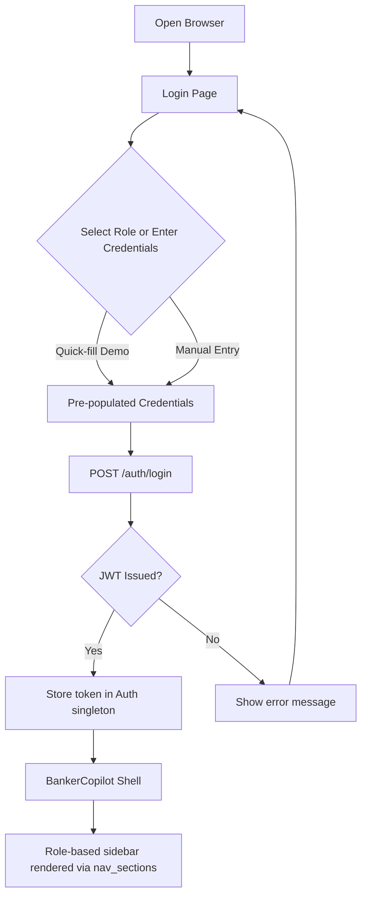

### AI Copilot Interaction Flow

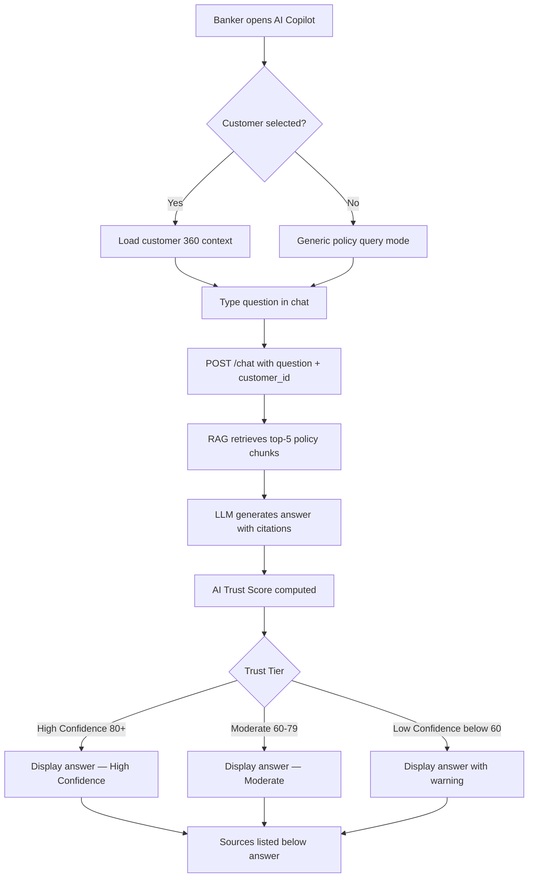

### Fraud Investigation Flow

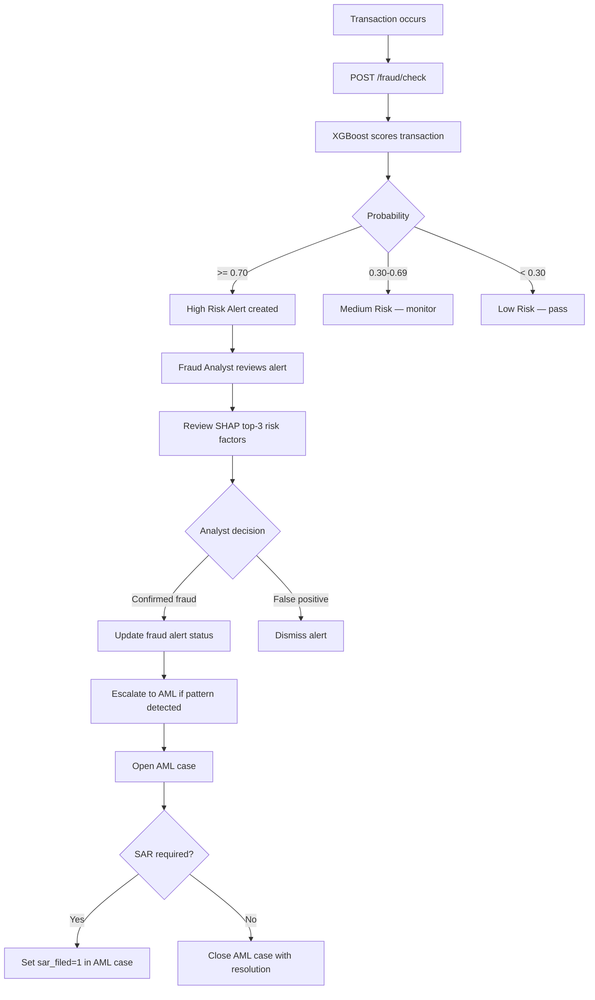

---

## Project Structure

```
TrustNova AI/
├── src/                          # Application source
│   ├── api/
│   │   ├── main.py               # FastAPI application entry point
│   │   ├── auth.py               # JWT, RBAC, 13 roles, demo users
│   │   ├── llm_router.py         # Multi-provider LLM routing + cost tracking
│   │   └── routes/               # 20 route modules
│   ├── models/
│   │   ├── ai_trust.py           # 5-component AI trust scorer
│   │   ├── database.py           # SQLAlchemy engine + table init
│   │   └── schemas.py            # Pydantic models
│   ├── rag/
│   │   ├── document_loader.py    # Document ingestion pipeline
│   │   ├── chunker.py            # Text chunking + section detection
│   │   ├── embeddings.py         # Sentence Transformers / OpenAI
│   │   ├── vector_store.py       # ChromaDB / Pinecone abstraction
│   │   ├── qa_chain.py           # ConversationalRetrievalChain
│   │   └── customer_context.py   # 360 degree customer brief builder
│   ├── intelligence/
│   │   ├── sentiment.py          # Batch sentiment + trend alerts
│   │   └── risk_profile.py       # Risk scoring + retention model
│   └── data/
│       ├── generate_customers.py  # 1,000 synthetic customer profiles
│       ├── generate_transactions.py
│       ├── generate_interactions.py
│       ├── generate_support_tickets.py
│       ├── generate_fraud_alerts.py
│       ├── generate_chat_transcripts.py
│       ├── generate_complaints.py
│       └── etl_pipeline.py        # Orchestrates all generators
│
├── frontend-react/               # React 18 + TypeScript frontend
│   ├── src/
│   │   ├── lib/
│   │   │   ├── api.ts            # Typed API client (all endpoints)
│   │   │   └── auth.ts           # Auth state singleton
│   │   ├── pages/
│   │   │   ├── LoginPage.tsx     # Auth + 13 demo role quick-fill
│   │   │   ├── BankerCopilot.tsx # Main shell (sidebar + routing)
│   │   │   └── FraudMonitor.tsx  # Fraud alert dashboard
│   │   └── components/           # 15+ feature component groups
│   ├── package.json
│   ├── package-lock.json         # Pinned for CI reproducibility
│   ├── vite.config.ts
│   ├── tsconfig.app.json
│   └── tailwind.config.js
│
├── data/
│   └── raw/banking_docs/         # 16 bank policy documents (TXT)
│
├── models/                       # Trained ML models (.pkl)
│   ├── fraud_xgboost_v2.pkl
│   ├── fraud_detector_v1.pkl
│   ├── fraud_random_forest.pkl
│   ├── fraud_isolation_forest.pkl
│   ├── fraud_autoencoder.pkl
│   ├── fraud_lstm.pkl
│   └── retention_model.pkl
│
├── deployment/
│   ├── Dockerfile.backend        # Python 3.11-slim + uvicorn
│   ├── Dockerfile.frontend       # node:20-alpine -> nginx:1.25-alpine
│   ├── Dockerfile.ml             # ML inference service
│   ├── docker-compose.yml        # 6-service stack
│   ├── nginx.conf                # Reverse proxy + SPA routing
│   ├── prometheus.yml            # Prometheus scrape config
│   ├── ml_service.py             # Standalone FastAPI ML inference
│   └── requirements.ml.txt       # ML-only Python dependencies
│
├── tests/                        # 291 passing test cases
│   ├── test_ai_trust.py
│   ├── test_customer_context.py
│   ├── test_fraud_models.py
│   ├── test_intelligence.py
│   ├── test_llm_router.py
│   ├── test_prompt_templates.py
│   ├── test_rag_system.py
│   └── ...
│
├── .github/
│   └── workflows/
│       ├── ci.yml                # Test -> Build -> Push to GHCR
│       └── deploy.yml            # Smoke test deployment
│
├── requirements.txt              # Python dependencies (pinned ranges)
└── banking.db                    # SQLite database (gitignored)
```

---

## CI/CD Pipeline

### CI Workflow (`.github/workflows/ci.yml`)

Triggers on every push to `main` or `dev`, and on PRs to `main`.

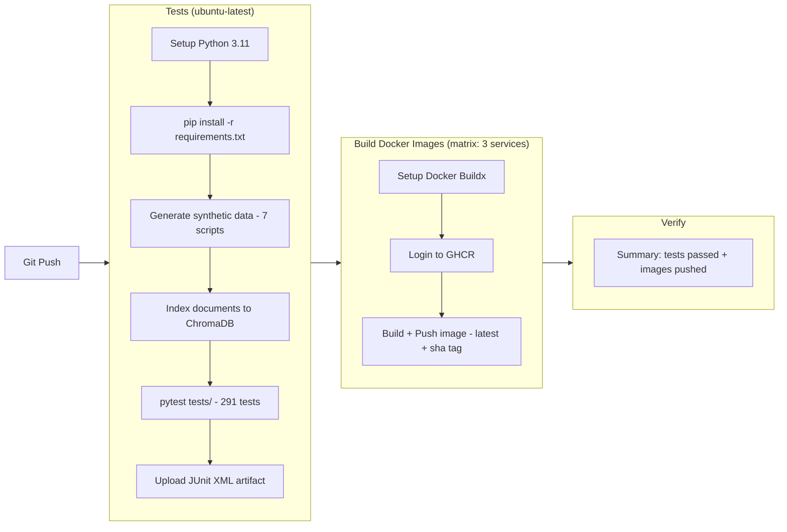

Images pushed to GHCR:
- `ghcr.io/prakash-94/trustnova-backend:latest`
- `ghcr.io/prakash-94/trustnova-frontend:latest`
- `ghcr.io/prakash-94/trustnova-ml-service:latest`

### Deploy Workflow (`.github/workflows/deploy.yml`)

Triggers after CI passes on `main`. Runs a containerised smoke test.

```mermaid
flowchart LR
    CI_PASS[CI Success] --> D1

    subgraph DEPLOY["Deploy Smoke Test"]
        D1[Login to GHCR] --> D2[Create .env from secrets]
        D2 --> D3[Build backend - GHA layer cache]
        D3 --> D4[Build frontend - GHA layer cache]
        D4 --> D5[Start ChromaDB container]
        D5 --> D6[Start Backend - wait 60s]
        D6 --> D7[Health check :8001/health - 12 retries x 15s]
        D7 --> D8[Start Frontend - wait 20s]
        D8 --> D9[Health check :80/]
        D9 --> D10[Teardown all containers]
    end
```

---

## Future Enhancements

The following capabilities are planned but not yet implemented:

| Feature | Description | Status |
|---------|-------------|--------|
| **PostgreSQL Migration** | Replace SQLite with production-grade PostgreSQL + Alembic migrations | Planned |
| **Row-Level Security** | Data isolation per role/branch at the database level | Planned |
| **Real-Time Alerts** | WebSocket push for fraud alerts and AML triggers | Planned |
| **Multi-Branch Support** | Branch-scoped data views and hierarchical role structure | Planned |
| **Document OCR** | Extract text from scanned KYC documents via OCR before indexing | Planned |
| **Customer Portal** | Separate customer-facing interface for self-service | Planned |
| **Model Retraining Pipeline** | Automated fraud model retraining with new transaction data | Planned |
| **Advanced Analytics** | Cohort analysis, churn prediction dashboards, cross-sell analytics | Planned |
| **Multi-Language Support** | Internationalisation for international banking deployments | Planned |
| **Mobile Application** | React Native companion for field bankers | Planned |
| **SWIFT/SEPA Integration** | Real-time payment network connectivity | Planned |
| **Regulatory Reporting** | Auto-generated FinCEN, BSA, GDPR compliance reports | Planned |

---

## License

This project is developed for portfolio and demonstration purposes.

© 2026 Prakashraj Javvaji. All rights reserved.

---

<div align="center">

**Built with FastAPI · React 18 · LangChain · XGBoost · ChromaDB · Docker**

*TrustNova AI — Where Banking Intelligence Meets Trustworthy AI*

</div>
